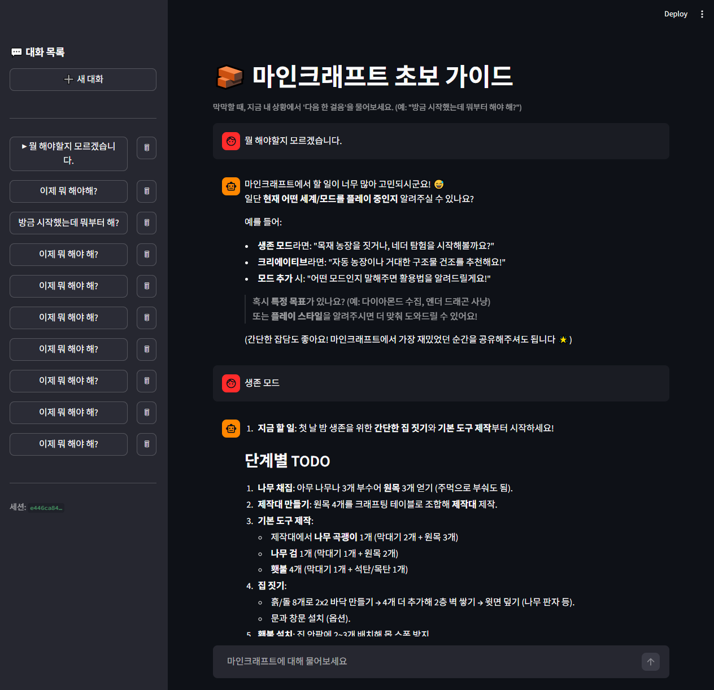
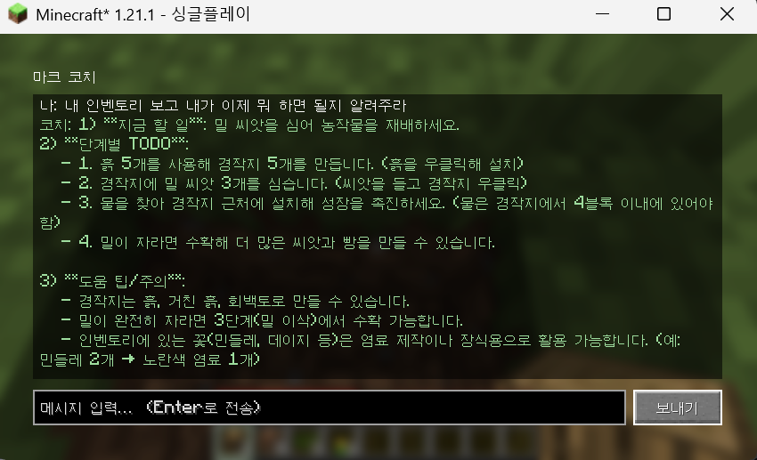
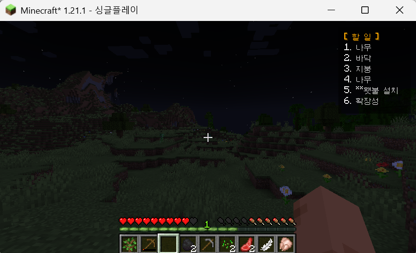
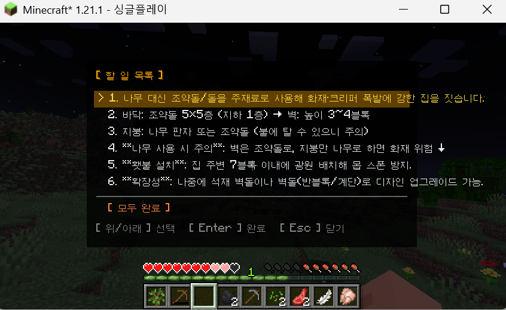

# 마인크래프트 초보 가이드 챗봇 (엔더드래곤)

마인크래프트를 처음 켜면 뭐부터 해야 할지 막막하죠. 이 프로젝트는 초보자의 지금 상황(가진 자원, 진행도)을 보고 "그래서 다음엔 뭘 하면 되는지"를 하나씩 짚어주는 챗봇입니다.

브라우저로도 쓸 수 있고, 마인크래프트 안에서 바로 물어볼 수도 있어요. 둘 다 같은 백엔드를 씁니다.

**사용 기술**: FastAPI, LangGraph, MySQL, Qdrant(Cloud), Upstage Solar, Fabric 모드, Streamlit(검증용)

---

## 🖥️ [서버 띄우기](docs/백엔드_사용법.md)

먼저 백엔드부터 켜야 합니다. 웹뷰든 게임 모드든 결국 이 서버를 호출하거든요.

```bash
cd project_code
cp .env.example .env          # UPSTAGE_API_KEY, 공유 QDRANT_URL/API_KEY 입력
docker compose up -d mysql    # 로컬 MySQL (Qdrant는 공유 클라우드 사용)
uv sync && uv run alembic upgrade head
bash start.sh                 # 백엔드 :8001, 웹뷰 :8002
```

위키 데이터(벡터 5,923개)는 공유 Qdrant Cloud에 이미 올려둬서, 따로 적재할 필요 없이 접속 정보만 받으면 바로 돌아갑니다. 설치하다 막히면 [백엔드 사용법](docs/백엔드_사용법.md)을 보세요.

## 🌐 [웹으로 써보기](docs/웹뷰_사용법.md)

브라우저에서 `http://localhost:8002`에 접속해서 질문을 입력하면 됩니다. 답변은 진행 상황이 단계별로 보이면서 실시간으로 흘러나오고, 사이드바에서 예전 대화를 다시 보거나 지울 수 있어요.

<p align="center">
  
</p>

## 🎮 [게임 안에서 써보기](docs/인게임_사용법.md)

마인크래프트 안에서 바로 코치를 부르는 Fabric 모드입니다.

```bash
cd minecraft-mod && ./gradlew runClient
```

월드에 들어간 뒤 채팅에 `/coach <질문>`을 치거나, **K**로 코치 창, **J**로 할 일 목록을 열 수 있습니다. 물어볼 때 지금 인벤토리와 게임 상태(시간·체력)를 같이 보내서, 상황에 맞춰 답해줍니다.

<p align="center">
  <br>
  <sub>채팅으로 코치에게 물어보기 (<code>/coach</code>)</sub>
</p>

코치가 알려준 할 일은 화면 우측 상단 HUD에 뜨고, **J**로 전체 목록을 펼쳐볼 수 있어요.

<div align="center">
  <table>
    <tr>
      <td align="center"><br><sub>우측 상단 할 일 HUD</sub></td>
      <td align="center"><br><sub>할 일 목록 전체 (J)</sub></td>
    </tr>
  </table>
</div>

---

## 🛠️ [어떻게 만들었나](docs/기술_문서.md)

- **에이전트 흐름** — 질문은 LangGraph **11노드**를 따라 `진척도 로드 → 분석 → 목표 해석 → 되묻기 → 검색 → 재료 점검 → 진행 인식 → 답변 → 저장` 순으로 흐릅니다.
- **결정론 제작 엔진** — "철 주괴 3개"·3×3 배치 같은 수치는 게임에서 추출한 레시피로 계산합니다(부족 재료·채굴 티어까지). LLM 추측이 아니라서 안 틀려요(#7).
- **검색(RAG) + 웹검색** — 답변 근거는 마인크래프트 위키에서 가져오고(Qdrant), 부족하면 **키 없이 마크 위키 API**로 보강합니다.
- **멀티턴 기억** — 직전 계획 대비 무엇을 끝냈고 이제 무엇을 할 차례인지 기억합니다(MySQL `coaching_state`).
- **게임 연동** — 모드는 인벤토리·게임 상태(시간·체력)를 같이 넘기고, 답변은 **토큰 단위로 흐르며** 3×3 제작법 격자·할 일 HUD로 보여줍니다.

더 자세한 내용(아키텍처, API, 이슈별 작업 내역)은 [기술 문서](docs/기술_문서.md)에 정리해뒀습니다.

## 🧭 아키텍처랑 에이전트 흐름

### 아키텍처

웹뷰와 Fabric 모드가 FastAPI를 거쳐 LangGraph로 들어가고, 그 뒤에 MySQL(세션·진척도), Qdrant(RAG), 결정론 지식(레시피·확정 사실), 마크 위키 API(웹검색 폴백), Upstage Solar(LLM·임베딩)가 붙습니다.

<p align="center">
  
</p>


### 에이전틱 워크플로우

<table align="center">
  <tr>
    <td align="center" valign="top"><br><sub>코칭 워크플로우 — 노드별 역할 개요</sub></td>
    <td align="center" valign="top"><br><sub>실제 그래프</sub></td>
  </tr>
</table>

---

## 📚 문서

| 문서                                            | 내용                                                             |
| ----------------------------------------------- | ---------------------------------------------------------------- |
| [백엔드 사용법](docs/백엔드_사용법.md)          | 백엔드(FastAPI) 클론부터 로컬 실행까지 (팀원 온보딩)             |
| [웹뷰 사용법](docs/웹뷰_사용법.md)              | Streamlit 검증용 웹뷰 쓰는 법                                    |
| [인게임 사용법](docs/인게임_사용법.md)          | Fabric 모드 인게임에서 쓰는 법                                   |
| [기술 문서](docs/기술_문서.md)                  | 사용 기술과 적용 방법 (아키텍처, 워크플로우, RAG, DB, 이슈 매핑) |
| [스펙 문서](docs/스펙문서.md)                   | 제품 설계, 범위, 협업 모델                                       |
| [구현 계획](docs/구현계획/)                     | 이슈별 구현 절차와 커밋 분해 (#5, #7)                            |
| [알려진 이슈](docs/알려진_이슈.md)              | 응답 품질 이슈 로그와 해결 기록                                  |
| [project_code/README](project_code/README.md)   | 백엔드·웹뷰 내부 구조와 코드                                     |
| [minecraft-mod/README](minecraft-mod/README.md) | 인게임 Fabric 모드 빌드와 구조                                   |

## 📂 폴더 구조

```
asm-team20-ai-study/
├── docs/                 설계·실행 문서 + 아키텍처 다이어그램
│
├── project_code/         백엔드(FastAPI·LangGraph) + 검증용 웹뷰
│   ├── app/
│   │   ├── agents/         LangGraph 노드 (분석·목표해석·검색·웹검색·재료점검·진행인식·응답·진척도)
│   │   ├── knowledge/      결정론 지식 (추출 레시피·플래너 + 확정 사실)
│   │   ├── core/           설정·DB·임베딩·LLM 연결
│   │   └── ...             graph·api·models·repositories·web_search 등
│   ├── frontend/          Streamlit 웹뷰
│   ├── scripts/           위키 적재 · 레시피 추출
│   └── alembic/ · tests/  마이그레이션 · 테스트
│
└── minecraft-mod/        인게임 Fabric 모드 (실제 메인 클라이언트)
    └── src/.../coach/
        ├── api/             백엔드 호출 · 인벤토리·게임상태 캡처
        ├── gui/             코치 창(스트리밍) · 3×3 격자 · 할 일 HUD
        └── config/          백엔드 주소·세션
```

웹뷰와 Fabric 모드는 같은 FastAPI API를 호출합니다. 그래서 백엔드는 어느 쪽 클라이언트에도 묶여 있지 않아요.
