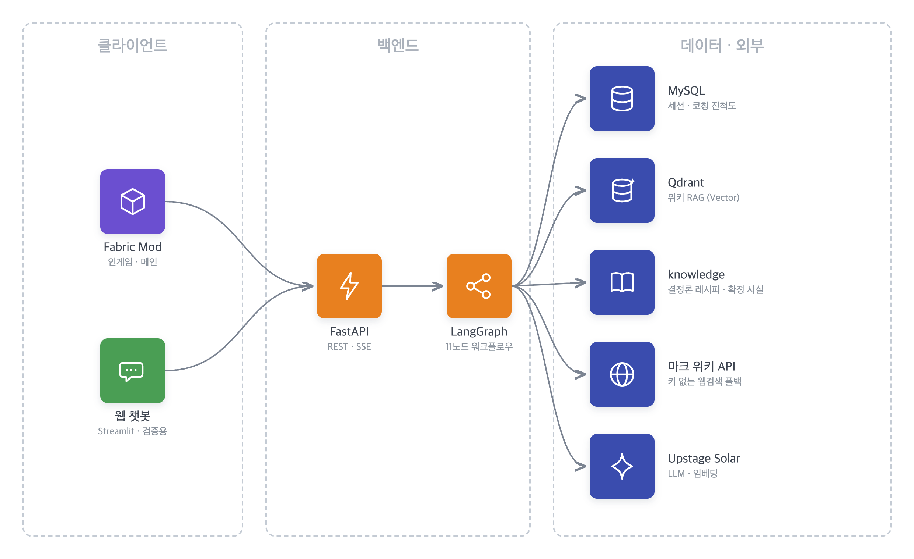
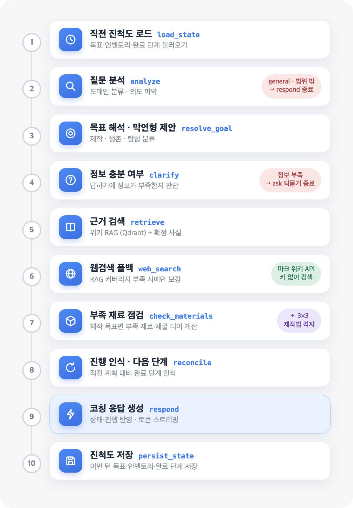
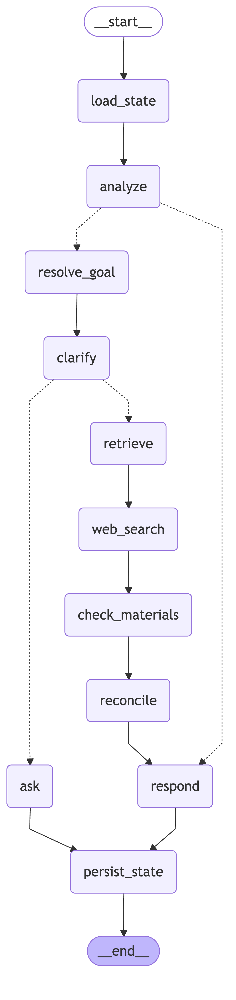

# 기술 문서 — 마인크래프트 초보 가이드 챗봇 (엔더드래곤)

> 프로젝트 전반의 **사용 기술과 적용 방법**을 정리한 문서다. 현행 구현(11노드 워크플로우) 기준이다.
> 설계 의도·확정안은 [재설계_에이전틱_워크플로우.md](재설계_에이전틱_워크플로우.md), 인게임/웹뷰 사용법은 [인게임_사용법.md](인게임_사용법.md) · [웹뷰_사용법.md](웹뷰_사용법.md) 참고.

---

## 1. 전체 아키텍처

마인크래프트 초보자의 **현재 상황(인벤토리·게임 상태·진척도)**을 파악해 목표까지의 **"다음 한 걸음"**을 안내하는 LLM 에이전트다. **인앱(Fabric 모드)이 메인 클라이언트**이며, 검증용 웹뷰와 함께 **하나의 백엔드 API**를 공유한다.

<p align="center">
  
</p>

**설계 원칙**: 백엔드는 클라이언트에 종속되지 않는다. 인게임 모드든 웹뷰든 동일한 `POST /api/v1/chat*` 계약만 지키면 된다.

> **인앱 기준 전환**: 인벤토리·게임 상태를 API로 직접 수집하므로, 초기 구상의 비전(스크린샷 분석)은 드롭했다.

### 기술 스택

| 영역 | 기술 | 적용 |
| --- | --- | --- |
| API 서버 | **FastAPI** + Uvicorn | `/api/v1/chat`(SSE), `/chat/sync`(동기), 세션 CRUD |
| 에이전트 | **LangGraph** | 상태 그래프 기반 **11노드** 워크플로우 |
| LLM | **Upstage Solar** (`solar-pro2`) | 질문 분석·목표 해석·되묻기 판단·코칭 응답 |
| 임베딩 | **Upstage** (`solar-embedding-1-large`) | 위키 적재·질의 임베딩 (차원 동적 측정) |
| 벡터 DB | **Qdrant** (Cloud 공유) | 위키 RAG 컬렉션 `minecraft_knowledge` |
| RDB | **MySQL 8** + SQLAlchemy 2 | users / chat_sessions / messages / **coaching_state** |
| 마이그레이션 | **Alembic** | 스키마 버전 관리(팀 동기화) |
| 결정론 지식 | **Python 인메모리** | 게임 jar 추출 레시피(`recipes.json`) + 확정 사실 |
| 웹검색 폴백 | **MediaWiki API** (ko.minecraft.wiki) | 키 없이 라이브 위키 검색, Tavily는 선택 |
| 검증 UI | **Streamlit** | 챗봇 동작 검증용 웹뷰 |
| 인게임 | **Fabric** (MC 1.21.1 · Java 21) | 실제 메인 클라이언트 모드 |
| 런타임 | Python 3.12 · `uv` · docker-compose | 의존성·로컬 인프라 |

---

## 2. LangGraph 워크플로우 (11노드)

`app/graph.py`가 상태 그래프를 정의한다. 상태 타입은 `app/schemas.py`의 `AgentState`(TypedDict).

```
load_state → analyze → resolve_goal → clarify →(ask) → retrieve → web_search → check_materials → reconcile → respond → persist_state
```

<table align="center">
  <tr>
    <td align="center" valign="top"><br><sub>노드별 역할 개요</sub></td>
    <td align="center" valign="top"><br><sub>실제 그래프 — 코드에서 자동 생성</sub></td>
  </tr>
</table>

| 노드 | 파일 | 역할 |
| --- | --- | --- |
| `load_state` | `agents/session_memory.py` | 직전 턴 진척도(목표·인벤토리·plan·완료 단계)를 `coaching_state`에서 로드 |
| `analyze` | `agents/query_analyzer.py` | domain(`minecraft`/`general`/`out_of_scope`)·keywords·intent를 structured output으로 추출 |
| `resolve_goal` | `agents/goal_resolver.py` | 목표 클래스 분류 + 막연한 질문이면 상태 근거로 다음 목표 제안 (LLM) |
| `clarify` | `agents/clarifier.py` | 정보가 부족하면 되묻기 질문 생성 (인벤토리 연동·직전 되묻기면 스킵) |
| `ask` | `graph.py` | 되묻기 질문을 최종 답변으로 반환 |
| `retrieve` | `agents/retrieval.py` | Qdrant 위키 검색 + `knowledge/`의 확정 사실 병행 조회 |
| `web_search` | `agents/web_searcher.py` | RAG 커버리지 부족 시에만 마크 위키(키 없음)로 근거 보강 |
| `check_materials` | `agents/material_checker.py` | 제작 목표가 있으면 결정론으로 부족 자원·채굴 티어 계산 + 3×3 격자 첨부 |
| `reconcile` | `agents/session_memory.py` | 직전 plan 대비 완료 단계 인식 + 다음 한 단계 산출 |
| `respond` | `agents/responder.py` | 도메인·상태·진행을 종합한 코칭 응답 생성 (minecraft는 토큰 스트리밍) |
| `persist_state` | `agents/session_memory.py` | 이번 턴 목표·인벤토리·plan·완료 단계 저장 (모든 종료 경로 공통, best-effort) |

**분기 규칙**
- `route_by_domain`: `minecraft`만 `resolve_goal`로, 그 외(`general`/`out_of_scope`)는 곧바로 `respond`.
- `route_by_clarification`: 되묻기 필요 시 `ask`, 아니면 `retrieve`.

**도메인별 응답 전략** (`responder.py`)
- `out_of_scope` → 고정 안내 문구 (LLM 호출 없음, 가드레일)
- `general` → temperature 0.5 가벼운 답변(마크 무관 지식은 답하지 않고 마크 질문 유도)
- `minecraft` → temperature 0.2 + `streaming=True`, 추천 목표·진행 상황·현재 상태·인벤토리·제작 분석·확정 규칙·참고 위키 블록을 프롬프트에 주입

### 2.1 목표 클래스 — 워크플로우가 다루는 범위

초보 코칭은 제작에 국한되지 않는다. `resolve_goal`이 목표를 분류하고, **결정론 엔진(`check_materials`)은 '제작' 목표에만 적용**된다(크래프팅 편향 방지). 나머지는 game_state + RAG + LLM으로 코칭한다.

| 클래스 | 예 | 주 처리 |
| --- | --- | --- |
| 🔨 craft (제작/자원) | "철 곡괭이 만들래" | `check_materials`로 부족 재료·티어 결정론 검증 + 레시피 격자 |
| 🌙 survival (생존/상황) | "밤인데 집이 없어" | game_state(시간·체력) + RAG |
| 🧭 explore (탐험/길찾기) | "동굴 가보고 싶어" | game_state(좌표) + RAG |
| 🤔 vague (막연형) | "이제 뭐 해야 해?" | 상태 보고 **다음 목표 제안** → 제안된 목표의 클래스로 처리 |

### 2.2 되묻기 무한 루프 방지

`clarify`는 "지금 뭐 해야 해?"처럼 상황 정보가 없으면 되묻는다. 단 무한 되묻기를 막기 위해 **상태 기반**으로 스킵한다.
- **인벤토리 연동(게임 모드)** 이면 보유 상황이 이미 전달됐으므로 되묻지 않는다.
- **직전 턴이 되묻기였으면** 스킵한다(메시지 role `clarification`으로 판정).

---

## 3. 결정론 제작 엔진 — 환각 없는 레시피·부족 재료 계산

제작 안내에서 "철 주괴 3개"처럼 **정확한 수치·배치**는 LLM 추측이 아니라 게임 데이터로 계산한다.

### 3.1 레시피 추출 — `scripts/extract_recipes.py`
MC 1.21.1 jar의 `data/minecraft/recipe/*.json`과 블록 태그를 일회성으로 추출해 `app/knowledge/recipes.json`으로 굽는다(읽기 전용·고정).

| 종류 | 개수 | 비고 |
| --- | --- | --- |
| shaped | 617 | `pattern`(행) + `key`(심볼→재료) — 3×3 배치 보존 |
| shapeless | 224 | 재료 목록 |
| cooking | 58 | 제련/제정/훈연/모닥불 |
| stonecutting | 167 | 석재 절단기 |
| mining | 101 | 블록별 최소 곡괭이 레벨(`needs_*_tool` 태그) |
| tags | 21 | 레시피가 참조하는 아이템 태그(예: `planks`) |

### 3.2 로더 — `app/knowledge/recipes.py`
`craft_recipes()` · `cooking_recipes()` · `tag_members()` · `is_craftable()` · `block_mining_level()` + **`recipe_grid(item_id)`**(shaped를 9칸 좌상단 정렬 격자로 정규화, 태그칸은 대표 구체 아이템으로 치환).

### 3.3 플래너 — `app/knowledge/planner.py`
- **`plan_materials(target, inventory)`** → `{tree, gather, blocked, ready}`. 목표를 재귀 분해해 **부족 재료·채굴 티어 차단**을 계산한다.
  - 채굴 기초재료(원석·조약돌)·몹/농사 재료(양털·가죽)는 분해하지 않고 수집(원석↔블록 압축 해제 회피).
  - 주괴는 제련 우선, 태그는 대표 구체 아이템으로 해석, 곡괭이 레벨 < 채굴 티어면 `blocked`.
- **`next_action(plan)`** → 결정론으로 '다음 한 단계'(제작 / 막히지 않은 낮은 티어부터 수집 / 전부 막히면 최저 티어 선행).

### 3.4 목표 해석 — `app/knowledge/goal_resolver.py`
`resolve_craft_target(query)`가 한국어 질문에서 제작 가능한 목표 아이템 ID를 집어낸다(가장 먼저·가장 긴 이름 우선).

### 3.5 적용 — `check_materials` 노드
질문(없으면 `resolve_goal`이 제안한 목표 문장)에서 제작 대상을 찾으면 `plan_materials` 결과와 `recipe_grid`를 상태에 싣고, `responder`가 `[제작 분석]` 블록으로 검증된 수치를 주입한다.

> 기존 `app/knowledge/minecraft_facts.py`(MINING_REQ·PICKAXE_LEVEL·ACQUIRE·ALIASES·`ITEM_ID_TO_KO`·`item_ko()`)와 `facts.py:lookup_facts()`의 **확정 사실 계층**도 유지되어 `[확정 규칙]` 블록으로 함께 주입된다(참고 위키보다 우선).

---

## 4. RAG — 위키 코퍼스와 Qdrant

### 코퍼스 / 적재 — `scripts/ingest_wiki.py`
- 출처: ko.minecraft.wiki를 Obsidian vault로 정리한 마크다운. 본문 약 1,225개 → 청킹 후 약 5,923개 벡터.
- vault 순회 → 본문 정리(위키링크·노이즈 압축) → `RecursiveCharacterTextSplitter` 청킹 → Upstage 임베딩 → Qdrant upsert.

```bash
uv run python scripts/ingest_wiki.py --limit 50   # 시범
uv run python scripts/ingest_wiki.py              # 전체 적재
```

### 검색 — `app/vector_store.py`
`search_documents(query, n_results)` → `[{content, metadata, distance}]`(distance에 Qdrant 유사도 score, 높을수록 유사). 컬렉션은 Cosine, 차원은 샘플 임베딩으로 동적 측정.

### 협업 모델
- 위키 벡터는 **공유 Qdrant Cloud에 1회 적재** → 팀원은 `QDRANT_URL`/`QDRANT_API_KEY`로 연결만.
- MySQL은 각자 로컬(세션·진척도는 개발 데이터).

### 4.1 웹검색 폴백 — `app/web_search.py` · `agents/web_searcher.py`
RAG 결과가 부족할 때만(결과 없음 또는 최고 유사도 < `WEB_SEARCH_MIN_SCORE`, 기본 0.5) 외부 검색으로 보강한다.
- **`wiki_search`(기본·키 불필요)**: ko.minecraft.wiki MediaWiki API(`generator=search` + `prop=extracts`)를 한 번 호출해 라이브 위키 본문을 가져온다. RAG는 위키 일부만 적재돼 있으므로 커버리지를 넓힌다.
- **`tavily_search`(선택)**: 위키가 비고 `TAVILY_API_KEY`가 있으면 일반 웹으로 폴백.
- 결과는 `search_results`와 동일 형식으로 변환해 뒤에 병합하며, 실패하면 빈 목록(best-effort).

---

## 5. 데이터 계층 — MySQL

### 스키마 — `app/models.py`
| 테이블 | 주요 컬럼 | 설명 |
| --- | --- | --- |
| `users` | id, external_id, created_at | 초기엔 익명/기본 유저 |
| `chat_sessions` | id, thread_id(unique), user_id(FK), created_at | `thread_id`가 대화 맥락 단위 |
| `messages` | id, session_id(FK), role, content, created_at | role: `user`/`assistant`/`clarification`(내부용) |
| `coaching_state` | thread_id(PK), state(JSON), updated_at | 세션별 코칭 진척도 스냅샷 |

- Alembic 마이그레이션(`0001_initial`, `0002_coaching_state`)으로 버전 관리 → `uv run alembic upgrade head`로 동기화.
- 접근 계층 `app/repositories.py`: 세션/메시지 함수 + `get_coaching_state` · `upsert_coaching_state`.
- 이력 로드/저장은 예외를 삼킨다 — **DB 장애가 응답을 막지 않는다**.

### 5.1 멀티턴 진척도 — `agents/session_memory.py`
`coaching_state`를 그래프에 연결해 턴을 넘어 진행을 기억한다.
- **`load_state`**(시작): 직전 목표·인벤토리·plan 단계·누적 완료 단계 로드.
- **`reconcile`**: ① 직전 인벤토리 대비 새로 얻은 재료(`[진행 상황]`), ② 같은 목표를 이어갈 때 직전 plan 중 더 필요 없어진 **완료 단계**를 가려내 누적(목표 바뀌면 초기화), ③ 현재 plan에서 **다음 한 단계** 산출 → `[목표 진행]`.
- **`persist_state`**(종료 전): 이번 턴 목표·인벤토리·plan·완료 단계 저장(없으면 직전 값 유지).

---

## 6. 게임 상태(인벤토리·시간·체력) 파이프라인

Fabric 모드가 호출 시점의 게임 상태를 캡처해 답변 정확도를 높인다.

1. **인벤토리** (`InventorySnapshot.capture`) — main·armor·offhand 슬롯을 `{ item, count }`로 수집.
2. **게임 상태** (`GameStateSnapshot.capture`) — 시간(낮/밤)·체력·배고픔·차원·좌표.
3. **전송** — `ChatRequest`에 `inventory[]` · `inventory_connected`(모드는 항상 true) · `game_state`로 실어 보냄.
4. **활용** (백엔드)
   - `retrieval.py`: 아이템 한국어명으로 검색 질의 보강.
   - `templates.py`: `format_inventory_block`(`[현재 인벤토리]`, 빈 인벤토리도 명시해 되묻기 방지) · `format_game_state_block`(`[현재 상태]`, 밤·저체력 위험 명시 → 생존 우선).

---

## 7. 인게임 UI

### 7.1 코치 창 — `gui/CoachScreen` (K키), 토큰 스트리밍
- 게임 채팅과 분리된 창에서 대화 기록을 스크롤로 보고 입력창·보내기로 대화.
- **SSE 스트리밍**: `CoachApiClient.chatStream`이 `/api/v1/chat`을 `BodyHandlers.ofLines()`로 한 줄씩 받아 `token`/`done` 이벤트를 분배 → 답변이 **토큰 단위로 점진 표시**된다. 콜백은 `MinecraftClient.execute`로 게임 스레드에서 처리.

### 7.2 3×3 제작법 격자 — `gui/RecipeGridWidget`
백엔드가 보낸 `recipe`(output·count·grid 9칸)를 `ItemStack`으로 변환해 작업대처럼 **3×3 슬롯 + 화살표 + 결과 슬롯**으로 렌더링한다. 게임 아이템 렌더러(`DrawContext.drawItem`)를 그대로 써서 별도 애셋이 없고, 슬롯 호버 시 아이템 이름 툴팁이 뜬다.

### 7.3 할 일(TODO) HUD — `TodoList`·`TodoHudRenderer`·`TodoScreen`(J키)
백엔드가 만든 짧은 `todos`(없으면 답변 파싱 폴백)를 화면 우측 상단 HUD와 목록 화면으로 보여준다. 완료 시 애니메이션·사운드.

> 채팅 명령 `/coach`는 게임 채팅창 특성상 sync(`chat()`)를 그대로 쓴다(스트리밍은 코치 창 전용).

---

## 8. API 계약

`app/main.py`가 라우터를 `/api/v1` prefix로 마운트한다.

| 엔드포인트 | 설명 |
| --- | --- |
| `POST /api/v1/chat/sync` | 동기 → `{ answer, domain, sources, todos, recipe }` — `/coach` 채팅 명령이 사용 |
| `POST /api/v1/chat` | SSE 스트리밍(노드 진행 + 토큰 + `done`) — **코치 창**과 웹뷰가 사용 |
| `GET /api/v1/sessions` | 최근 대화 목록(미리보기 포함) |
| `GET /api/v1/sessions/{thread_id}/messages` | 세션 전체 메시지 |
| `DELETE /api/v1/sessions/{thread_id}` | 세션·메시지 삭제(cascade) |
| `GET /health` | 상태 확인 |

**요청 본문**: `{ message, thread_id, inventory[], inventory_connected, game_state }`
- `thread_id`로 세션·진척도를 식별·저장하고, 최근 `HISTORY_MESSAGE_LIMIT(6)` 메시지를 맥락으로 사용.
- `inventory`·`game_state`는 모드만 채운다(웹뷰는 비움).

### SSE 스트리밍 이벤트
`POST /api/v1/chat`는 `graph.astream_events`를 구독해 흘려보낸다.
- `event: "node"` — 노드 완료 진행 상황
- `event: "token"` — `respond` 노드의 LLM 토큰(점진 출력)
- `event: "done"` — 최종 `{ answer, domain, sources, todos, recipe }`

> 노드(LLM/벡터DB) 예외로 스트림이 끊겨도 `done`과 DB 저장은 보장한다.

---

## 9. 상태 스키마 — `AgentState`

`app/schemas.py`의 `AgentState`(TypedDict)가 노드 간 전달 상태다. 주요 필드:

| 그룹 | 필드 |
| --- | --- |
| 입력 | `thread_id`, `query`, `history_text`, `inventory`, `inventory_connected`, `game_state`, `prev_was_clarification` |
| 분석 | `query_analysis`, `domain`, `need_clarification`, `clarification_question` |
| 목표 | `goal_class`, `resolved_goal`, `goal_proposed`, `goal_key`, `material_plan`, `recipe` |
| RAG | `search_results`, `structured_facts` |
| 진척도 | `prior_goal_key`, `prior_last_inventory`, `prior_plan`, `prior_completed`, `progress_note`, `completed_steps`, `goal_completed`, `next_step` |
| 출력 | `final_answer`, `todos` |

---

## 10. 현재 한계와 남은 작업

- **웹 레시피 표시**: 모드는 3×3 격자를 렌더하지만, 웹뷰용 ASCII 폴백은 미구현.
- **세션 메모리**: 컨텍스트 장기 요약 미구현(현재 최근 6턴 + 진척도 스냅샷).
- **인게임 실검증**: 레시피 격자·토큰 스트리밍은 컴파일·와이어 포맷까지 확인했고, 실제 클라이언트 화면 검증은 별도 필요.
- **배포**: 미구현(BE: EC2, 벡터: Qdrant Cloud 예정).

> 품질 한계의 상세는 [알려진_이슈.md](알려진_이슈.md) 참고.
